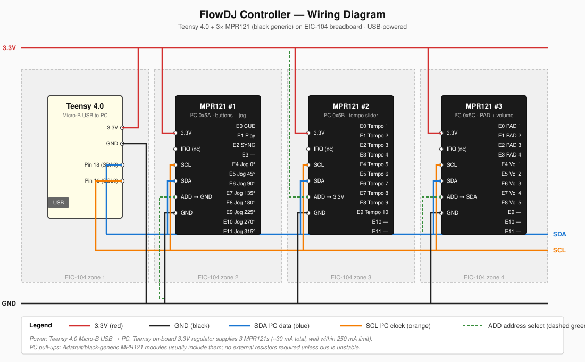

# 03 — 接線手冊（Teensy + 3×MPR121 + 麵包板）

本章把所有電線怎麼接講清楚。先從「最小可動系統」開始：**1 顆 MPR121 + Teensy**，驗 OK 了再加第 2、第 3 顆。

## 整體接線示意圖



（如果你想要 Fritzing 麵包板視覺風格的圖，見 [07-fritzing-guide.md](07-fritzing-guide.md)）

---

## 你需要準備的東西

| 物品 | 數量 | 備註 |
|---|---|---|
| Teensy 4.0 | 1 | 已焊 pin header（跨麵包板中央溝槽） |
| **黑色通用 MPR121 模組**（3.3V/IRQ/SCL/SDA/ADD/GND） | 3 | 焊好 pin header；若用 Adafruit 藍板也可，把 `3.3V`→`VIN`、`ADD`→`ADDR` 對應即可 |
| 標準麵包板（830 點）或 EIC-104 | 1 | 大一點方便排，EIC-104 的四區結構更整齊 |
| 公對公杜邦線 | 15+ | 接 I²C bus 用，建議 ≥ 3 色（紅=3.3V、黑=GND、藍/黃=I²C） |
| 22 AWG 單芯線（solid core）| 0.5 m | 電極延長線；單芯比多股好插麵包板 |
| 銅箔膠帶（0.5–2 cm 寬） | 1 捲 | 做測試用電極 |
| 10 kΩ 電阻 | 2 | **備用** I²C pull-up；黑色通用模組通常已內建（見下方說明） |
| 0.1 µF 陶瓷電容 | 3 | **選配**，每顆 MPR121 VCC/GND 之間加一顆提升穩定性（Adafruit 官方 schematic 有） |
| Micro-B USB 線 | 1 | **Teensy 4.0 是 Micro-B，不是 USB-C** |
| 萬用電表 | 1 | 驗電壓、驗連線、量 pull-up 電阻 |

---

## 接線原則

1. **電源、GND 優先接**：先把 3.3V / GND 接好通電，用萬用表量 MPR121 的 `3.3V` 腳對 GND 應該讀到 3.3 V
2. **I²C 兩條線並聯**：3 顆 MPR121 的 SDA 全部接一起、SCL 全部接一起（同一個電氣節點）
3. **`ADD` 每顆不同**：這是唯一需要「每顆不一樣」的腳位（見 [02-mpr121-pinout.md](02-mpr121-pinout.md)）
4. **電極線最後接**：I²C 通了才考慮接電極
5. **線盡量短**：I²C bus 不要超過 20 cm、電極線不超過 30 cm，否則容易收干擾

## 關於 I²C pull-up 電阻 ⚠️

**重要判斷：黑色通用模組通常板上已有 10 kΩ pull-up**（焊在板子背面的 SDA/SCL 兩個電阻）。

3 顆並聯時：3 × 10 kΩ = **約 3.3 kΩ 有效 pull-up**。
- 這仍在 I²C 標準容許範圍（Standard-mode 100 kHz 最小 Rp ≈ 1 kΩ @ 3.3 V，算法見 [TI SLVA689 — I²C Pull-up Resistor Calculation](https://www.ti.com/lit/an/slva689/slva689.pdf)），**多數情況可以直接動**。
- 若 I²C 不穩（scanner 抓到亂七八糟位址或抓不到），兩種處理方式：
  1. **拆掉其中 2 顆的板上 pull-up**（用烙鐵把電阻拔掉，只留 1 顆 10 kΩ）
  2. **或在 Teensy 端另外拉一組 4.7 kΩ 到 3.3V**，然後全部 3 顆板上 pull-up 拆掉

**所以備用的 10 kΩ 電阻**：只在 3 顆板子都沒 pull-up 時才要拉外部。絕大多數情況你不會用到。

**怎麼判斷板子有沒有 pull-up：**
還沒通電、沒插到 Teensy 時，用萬用表量 MPR121 的 `SDA` → `3.3V` 腳的電阻：
- 讀到 ~10 kΩ → 有 pull-up
- 讀到無窮大 → 沒有 pull-up，要外拉

---

## 階段 A — 最小系統（1 顆 MPR121）

目標：讓 Teensy 看得到 1 顆 MPR121，Serial Monitor 印出 `0x5A`。

### 接線表

**本專案使用的是黑色通用模組**，電源腳標示為 **3.3V**（不是 VIN）、位址腳標示為 **ADD**（不是 ADDR）。若你用 Adafruit 版把 `3.3V` 改成 `VIN`、`ADD` 改成 `ADDR` 就好。

```
Teensy 4.0          MPR121 #1 (地址 0x5A)
────────────        ─────────────────────
3.3V     ────────►  3.3V  (Adafruit 版叫 VIN)
GND      ────────►  GND
Pin 18   ────────►  SDA
Pin 19   ────────►  SCL
GND      ────────►  ADD   ← 用跳線明確拉到 GND（不要懸空！位址 = 0x5A）
(不接)              IRQ
```

⚠️ **黑色通用板只能吃 3.3V，不要誤接 5V！** 會燒 IC。

💡 **為什麼 ADD 建議用跳線拉到 GND，不能懸空？** 雖然大多數板子有板載 pull-down，但不保證 —— 懸空時浮接電位不確定，位址可能從 0x5A 變成 0x5D 或根本掃不到。用跳線強制拉到 GND = 一次解決，換板也不會出錯。

### 麵包板擺法（建議）

```
       上方 row
┌─────────────────────────────────┐
│ + + + + + + + + + + + + + + + + │ ← 紅 rail：3.3V
│ - - - - - - - - - - - - - - - - │ ← 黑 rail：GND
├─────────────────────────────────┤
│                                 │
│  [Teensy 4.0]                   │
│   跨中間溝槽                     │
│                                 │
├─────────────────────────────────┤
│  [MPR121 #1]                    │
├─────────────────────────────────┤
│ + + + + + + + + + + + + + + + + │
│ - - - - - - - - - - - - - - - - │
└─────────────────────────────────┘
       下方 row
```

---

## 階段 B — 加第 2 顆 MPR121（ADD → 3.3V）

所有電源線、I²C 線照舊，**`ADD` 腳改接到紅 rail（3.3V）**。

### 接線表

```
Teensy 4.0          MPR121 #2 (地址 0x5B)
────────────        ─────────────────────
3.3V     ────────►  3.3V
GND      ────────►  GND
Pin 18   ────────►  SDA   (跟 #1 同一條線)
Pin 19   ────────►  SCL   (跟 #1 同一條線)
3.3V     ────────►  ADD   ← 拉到 3.3V，位址變 0x5B
```

---

## 階段 C — 加第 3 顆 MPR121（ADD → SDA）

### 接線表

```
Teensy 4.0          MPR121 #3 (地址 0x5C)
────────────        ─────────────────────
3.3V     ────────►  3.3V
GND      ────────►  GND
Pin 18   ────────►  SDA   (跟 #1、#2 同一條線)
Pin 19   ────────►  SCL   (跟 #1、#2 同一條線)
Pin 18   ────────►  ADD   ← 接到 SDA 線上，位址變 0x5C
```

💡 **不用擔心 SDA 一直 toggle 會讓 ADD 跳位址：** MPR121 在「上電那一刻」就決定位址了，之後 SDA 怎麼震盪都不影響（MPR121 datasheet §Initialization）。

---

## 三顆 MPR121 角色與電極分配

| 顆 | 位址 | 角色 | 通道分配 |
|---|---|---|---|
| **#1** | 0x5A | 按鈕 + Jog 前半 | 見下表 |
| **#2** | 0x5B | 速度 slider | 見下表 |
| **#3** | 0x5C | PAD + 音量 fader | 見下表 |

### #1 MPR121 @ 0x5A

| Ch | 接到什麼 |
|---|---|
| 0 | CUE 按鈕電極 |
| 1 | Play/Pause 按鈕電極 |
| 2 | SYNC 按鈕電極 |
| 3 | (保留) |
| 4 | Jog 段 1（0°） |
| 5 | Jog 段 2（45°） |
| 6 | Jog 段 3（90°） |
| 7 | Jog 段 4（135°） |
| 8 | Jog 段 5（180°） |
| 9 | Jog 段 6（225°） |
| 10 | Jog 段 7（270°） |
| 11 | Jog 段 8（315°） |

### #2 MPR121 @ 0x5B

| Ch | 接到什麼 |
|---|---|
| 0 | 速度 slider pad 1（最上） |
| 1 | 速度 slider pad 2 |
| 2 | 速度 slider pad 3 |
| 3 | 速度 slider pad 4 |
| 4 | 速度 slider pad 5 |
| 5 | 速度 slider pad 6 |
| 6 | 速度 slider pad 7 |
| 7 | 速度 slider pad 8 |
| 8 | 速度 slider pad 9 |
| 9 | 速度 slider pad 10（最下） |
| 10–11 | (保留) |

### #3 MPR121 @ 0x5C

| Ch | 接到什麼 |
|---|---|
| 0 | PAD 1 |
| 1 | PAD 2 |
| 2 | PAD 3 |
| 3 | PAD 4 |
| 4 | 音量 fader pad 1（−） |
| 5 | 音量 fader pad 2 |
| 6 | 音量 fader pad 3 |
| 7 | 音量 fader pad 4 |
| 8 | 音量 fader pad 5（＋） |
| 9–11 | (保留) |

---

## 電極的接法（銅箔膠帶版）

測試階段先用銅箔膠帶做電極。流程：

1. **剪銅箔**：按所需形狀剪（矩形、弧形、圓形都可）
2. **焊/繞一條細單芯線**：銅箔一角焊條線（或用銅箔把線「夾起來」多貼幾層），線另一端接到 MPR121 對應的 Ch 腳
3. **貼到版子上**：銅箔背面有膠，直接貼到壓克力或 3D 列印件上
4. **氣墊覆蓋**：你的塑膠氣墊直接蓋在銅箔上（按壓氣墊時氣墊壓到銅箔 → 觸發）

**注意：**
- 同一條線上不要有明顯的開路或虛焊
- 兩個相鄰電極之間**不要讓銅箔相連**（會被當同一個電極）
- 線長建議 < 30 cm（太長會收到干擾、靈敏度漂）

---

## 接線檢查 checklist

### 通電前（USB 還沒插上）

- [ ] 3.3V 對 GND：**不應該短路**（讀到 0 Ω 就是接錯了，千萬別插 USB！）
- [ ] SDA 對 SCL：應該**不導通**（讀無窮大；若 0 Ω 就是短路）
- [ ] 每顆 MPR121 的 `ADD` 腳：
  - #1 的 `ADD` 對 GND：應該導通（跳線通到 GND）
  - #2 的 `ADD` 對 3.3V：應該導通（跳線通到 3.3V rail）
  - #3 的 `ADD` 對 SDA（Pin 18）：應該導通
- [ ] I²C pull-up 檢查：量任一 MPR121 的 `SDA` 對 `3.3V` 腳，應讀到 **3.3 kΩ 左右**（3 顆並聯 10 kΩ 的結果）

### 通電後（USB 插上）

- [ ] Teensy `3.3V` 腳對 GND：讀 3.3 V ± 0.1 V
- [ ] 每顆 MPR121 的 `3.3V` 腳對 GND：讀 3.3 V（確認並聯 OK）
- [ ] SDA 對 GND：讀約 3.3 V（pull-up 把線拉高，無 I²C 流量時）
- [ ] SCL 對 GND：同上
- [ ] 摸 MPR121 本體 IC：**不應該燙**。燙 = 接錯電源，馬上拔 USB！

全部 ✓ 才算完工，接著去 Phase 1 跑 I²C scanner。

---

## 常見接錯

| 症狀 | 可能原因 | 驗證方法 |
|---|---|---|
| Teensy 插 USB 後 PC 沒反應 | Teensy 韌體沒燒或 USB Type 沒選 | 重燒 Blink 範例、確認 Tools → USB Type 選 `Serial + MIDI` |
| I²C scanner 沒找到任何裝置 | SDA/SCL 接反、3.3V 沒通、或完全沒 pull-up | 萬用表量 SDA → 3.3V 阻值（應 ~3.3 kΩ），量 3.3V 對 GND（應 3.3V） |
| 找到一顆但不是 0x5A | `ADD` 腳接錯（若發現是 0x5B 代表 `ADD` 被拉到 3.3V） | 直接量 `ADD` 腳電位 |
| 找到 2 顆少 1 顆 | 少的那顆 `ADD` 接錯，或電源沒並到位 | 量該顆 MPR121 的 `3.3V` 腳有沒有 3.3V |
| 找到一堆奇怪位址（0x48, 0x68, ...） | I²C pull-up 太弱或完全沒有 | 加 4.7 kΩ 外部 pull-up |
| MPR121 IC 發燙 | 餵錯電壓（5V 進 3.3V 腳）或電源接反 | **立刻拔 USB**，重查接線 |
| 電極不靈敏 | 線太長、銅箔面積太小、或閾值太高 | 縮短線長 / 調降 threshold |
| 電極誤觸發 | 相鄰電極太近、線路被雜訊干擾、或閾值太低 | 增加電極間距 / 調高 threshold |

**外部資源：**
- [SparkFun MPR121 Hookup Guide](https://learn.sparkfun.com/tutorials/mpr121-hookup-guide/all) — 另一套接線參考（含照片）
- [Adafruit MPR121 Wiring 章節](https://learn.adafruit.com/adafruit-mpr121-12-key-capacitive-touch-sensor-breakout-tutorial/wiring) — 含實拍照片
- [Teensy Wire library 文件](https://www.pjrc.com/teensy/td_libs_Wire.html) — 確認 Pin 18/19 = SDA0/SCL0
- [I²C pull-up 電阻計算（TI SLVA689）](https://www.ti.com/lit/an/slva689/slva689.pdf) — 如果你想自己算多顆並聯的有效 Rp

---

## 下一章

接線 OK 之後，去 [06-testing-plan.md](06-testing-plan.md) 跑測試流程。
